# Déploiement

Dans le dossier docker, modifier le fichier .env.local avec les bonnes informations.
Renommer le fichier .env.local en .env

```bash
docker compose up -d
```

## Utilisation

Survoler l'icone de l'utilisateur en haut à droite de l'écran. Puis cliquer sur "Se connecter".

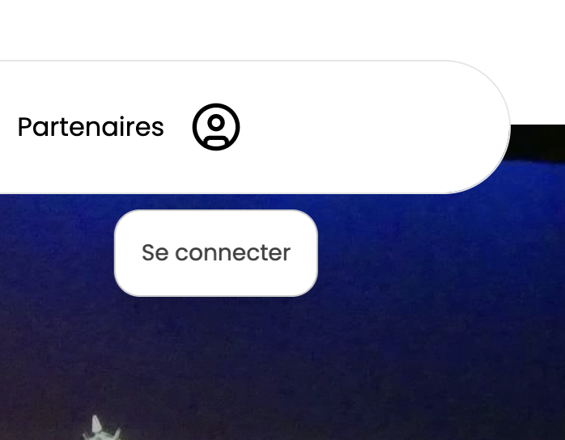

Connectez-vous à l'application avec l'utilisateur admin (admin@admin.com) et le mot de passe admin (tR&^3&IanGX#sVaqK^V&CZwWq#RbMbwM@1O1!Nr).

A votre première connexion, vous devrez modifier votre mot de passe et le mail de l'administrateur.

Une fois votre mot de passe et votre mail modifié, vous pourrez accéder au panneau d'administration en survolant l'icone de l'utilisateur en haut à droite de l'écran. Puis cliquer sur "Panneau d'administration".

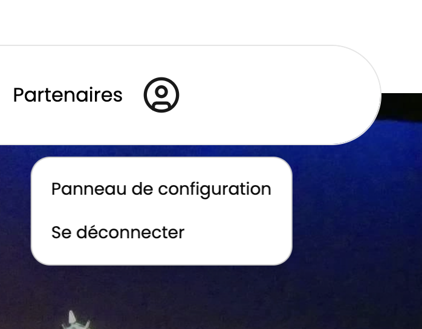

### Panneau d'administration

Sur la page d'accueil du panneau d'administration, vous verrez les différentes catégories. Ces sections sont aussi accessibles depuis le menu à gauche de l'écran.

#### Partenaires

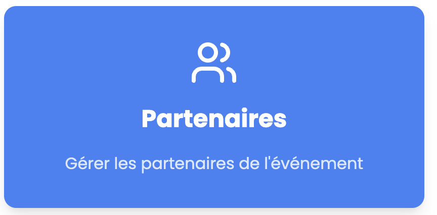

Dans la section "A propos" sur chaque elements vous avez un icone de corbeille et de pinceau qui permet la suppression de l'élément ainsi que la modification de l'élément.

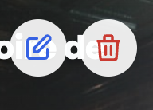

Et pour ajouter un partenaire il suffit de cliquer sur le bouton "Ajouter un partenaire" en haut à droite, puis de remplir le formulaire.

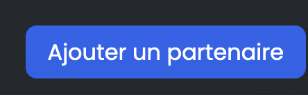

#### A propos

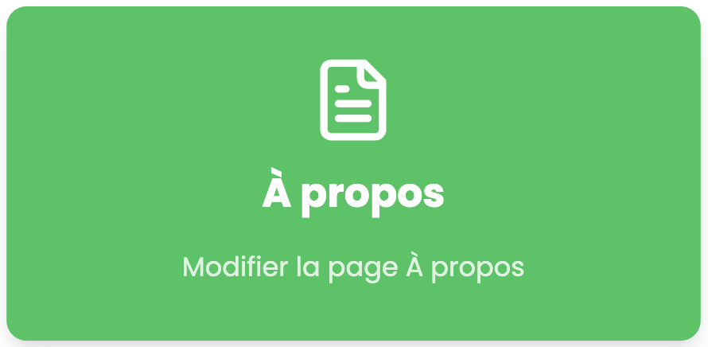

Dans la section "A propos" ecriver ce que vous souhaitez et utiliser la barre de mise en forme pour mettre en forme votre texte.

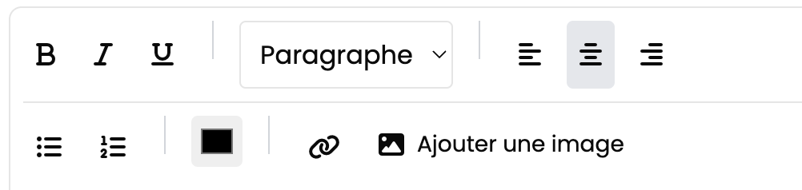

#### Evenements

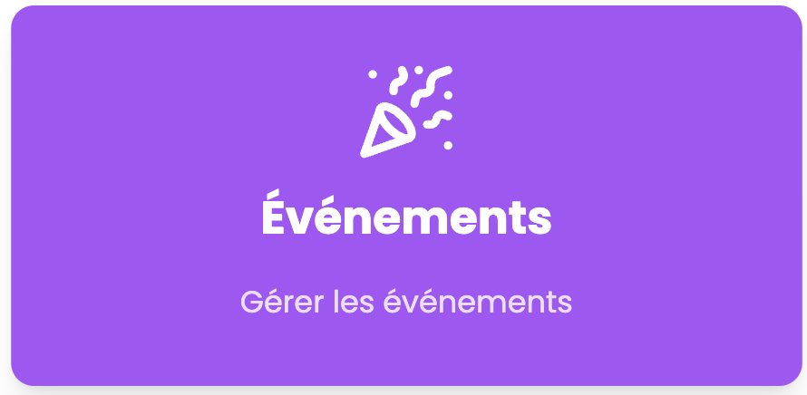

Dans la section "Evenements" vous pouvez ajouter un évènement en cliquant sur le bouton "Ajouter un évènement" en haut à droite, puis de remplir le formulaire.

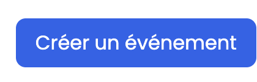

Vous pouvez également modifier et supprimer un évènement en cliquant sur l'icone de pinceau ou de corbeille sur l'évènement que vous souhaitez modifier ou supprimer.

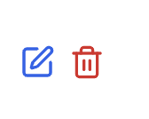

#### Revue de presse

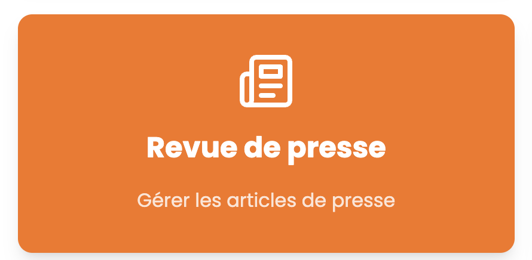

Pour la revue de presse, collé simplement le lien de l'article dans le champ "URL de l'article" et cliquez sur "Extraire".

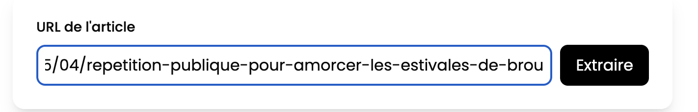

Une fois l'extraction terminée, vous verrez les informations de l'article extraite automatiquement, ces informations peuvent etre modifiées manuellement.

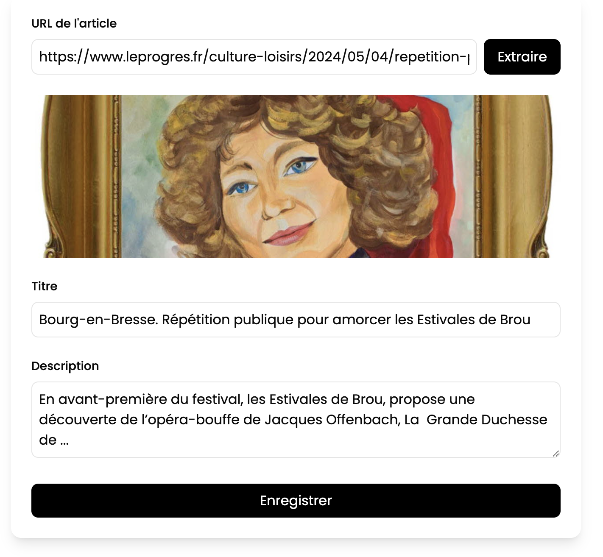

#### Utilisateurs

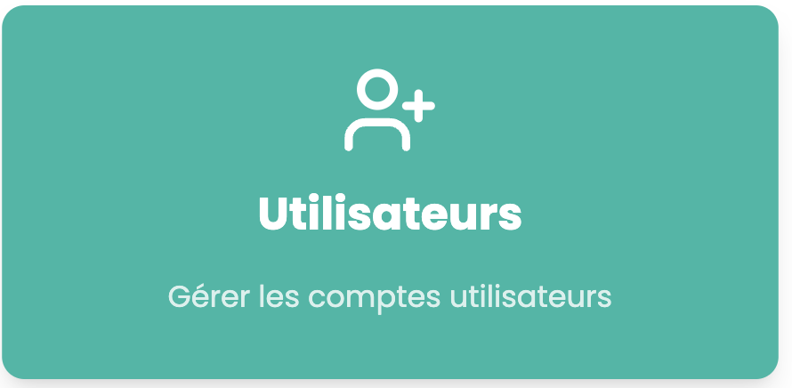

Pour crée un nouvelle utilisateur, il suffit de remplire le formulaire et de cliquer sur "Créer".

Attention l'utilisateur doit avoir un mot de passe d'au moins 14 caractères, possedantune majuscule et un caractère spécial. Ce mot de passe pouras bien sur être modifié par l'utilisateur.

#### Gestion des medias


Dans la page medias vous pouvez voir tous les medias qui on été ajouter via des evennements. Si vous cliquer sur le petit coeur, vous pourrez ajouter le media à votre favoris. Ajouter un media à votre favoris permet de le voir dans le carrousel de la page d'accueil.

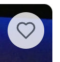


#### Newsletter


Dans la sections vous pouvez envoyer une newsletter à tous les utilisateurs qui ce sont inscrit à la newsletter.

Pour rappelle une newsletter est egalement envoyé par mail à chaque nouvelle création d'évènement.

### Interface utilisateur

## En cas de problème

Si vous rencontrez un problème, veuillez contacter bastien.desprez@etu.univ-lyon1.fr, valentin.goux@etu.univ-lyon1.fr, benjamin.brajon@etu.univ-lyon1.fr ou antoine.ducolomb@etu.univ-lyon1.fr.

# Documentation Technique - Projet Estivales de Brou

## Table des matières

1. [Architecture du projet](#architecture-du-projet)
2. [Configuration et Installation](#configuration-et-installation)
3. [Structure de la base de données](#structure-de-la-base-de-données)
4. [Authentification](#authentification)
5. [Gestion des fichiers](#gestion-des-fichiers)
6. [API Routes](#api-routes)
7. [Composants principaux](#composants-principaux)

## Architecture du projet

Le projet est construit avec :

- Next.js (Framework React)
- MySQL (Base de données)
- Docker (Conteneurisation)
- TypeScript

### Structure des dossiers

```
.
├── app/
│   ├── api/           # Routes API
│   ├── admin/         # Pages d'administration
│   ├── components/    # Composants réutilisables
│   └── ...           # Autres pages et fonctionnalités
├── docker/           # Configuration Docker
├── lib/             # Utilitaires et configurations
└── public/          # Fichiers statiques
```

## Configuration et Installation

### Prérequis

- Docker et Docker Compose
- Node.js 18+
- Git

### Installation

1. Cloner le projet :

```bash
git clone https://iutbg-gitlab.iutbourg.univ-lyon1.fr/sae-but31/2024-25-web/estivales-brou.git
```

2. Configuration des variables d'environnement :

```bash
# Copier le fichier d'exemple
cp .env.example .env
```

Voici le contenu complet du fichier `.env` à configurer :

```bash
# Configuration GitLab
GITLAB_TOKEN=     # Votre token d'accès GitLab

# Configuration de la base de données
DB_HOST=db        # Nom du service dans docker-compose
DB_USER=          # Votre nom d'utilisateur MySQL
DB_PASSWORD=      # Votre mot de passe MySQL
DB_NAME=          # Nom de votre base de données

# Configuration phpMyAdmin
MYSQL_ROOT_PASSWORD=  # Mot de passe root MySQL
MYSQL_DATABASE=       # Même nom que DB_NAME
MYSQL_USER=          # Même nom que DB_USER
MYSQL_PASSWORD=      # Même mot de passe que DB_PASSWORD
PMA_HOST=db          # Même valeur que DB_HOST
PMA_USER=            # Même nom que DB_USER
PMA_PASSWORD=        # Même mot de passe que DB_PASSWORD

# Configuration SMTP pour l'envoi d'emails
SMTP_HOST=        # Exemple : smtp.gmail.com
SMTP_PORT=        # Exemple : 587 pour TLS
SMTP_SECURE=      # true pour SSL, false pour TLS
SMTP_USER=        # Votre adresse email
SMTP_PASSWORD=    # Votre mot de passe SMTP
SMTP_FROM=        # Adresse d'envoi des emails
CONTACT_EMAIL=    # Adresse de réception des formulaires de contact

# Configuration du site
NEXT_PUBLIC_BASE_URL=  # URL complète de votre site (https://votre-domaine.com)

# Sécurité
JWT_SECRET=       # Chaîne aléatoire pour sécuriser les tokens
```

### Guide de configuration

#### 1. Base de données

La base de données est configurée via Docker. Assurez-vous que les variables DB*\* et MYSQL*\* correspondent entre elles. Le `DB_HOST` doit être `db` car c'est le nom du service dans le docker-compose.

#### 2. Serveur SMTP

Pour configurer l'envoi d'emails, vous avez plusieurs options :

**Avec Gmail :**

1. Activez l'authentification à deux facteurs sur votre compte Google
2. Générez un "mot de passe d'application" dans les paramètres de sécurité
3. Utilisez ce mot de passe comme `SMTP_PASSWORD`
4. Configurez les variables :
   - SMTP_HOST=smtp.gmail.com
   - SMTP_PORT=587
   - SMTP_SECURE=false

Autres services disponibles : SendGrid, Amazon SES, etc.

#### 3. URL du site

Le `NEXT_PUBLIC_BASE_URL` doit être l'URL complète de votre site, incluant le protocole https://. Par exemple : https://estivales-brou.fr

#### 4. Sécurité

Pour générer une chaîne aléatoire sécurisée pour `JWT_SECRET`, utilisez la commande :

```bash
node -e "console.log(require('crypto').randomBytes(64).toString('hex'))"
```

3. Lancement avec Docker :

```bash
docker compose up -d
```

## Structure de la base de données

### Tables principales

- `User` : Gestion des utilisateurs
- `Event` : Événements
- `Partenaire` : Partenaires
- `PasswordReset` : Réinitialisation des mots de passe

### Types d'utilisateurs

- Admin (userType = 0)
- Utilisateur standard (userType = 1)

## Authentification

Le système d'authentification utilise JWT (JSON Web Tokens).

### Processus de connexion

```15:114:app/api/auth/login/route.ts
export async function POST(request: Request) {
  try {
    const body = await request.json();
    const { email, password } = body;

    console.log("Tentative de connexion pour:", email);

    if (!email || !password) {
      return NextResponse.json(
        { message: "Email et mot de passe requis" },
        { status: 400 }
      );
    }

    const connection = await pool.getConnection();

    try {
      // Récupérer l'utilisateur par email
      const [users] = await connection.query<User[]>(
        "SELECT id, email, password, username, userType FROM User WHERE email = ?",
        [email]
      );

      console.log("Résultat de la requête:", users);

      if (!Array.isArray(users) || users.length === 0) {
        console.log("Aucun utilisateur trouvé avec cet email");
        return NextResponse.json(
          { message: "Email ou mot de passe incorrect" },
          { status: 401 }
        );
      }

      const user = users[0];
      console.log("Utilisateur trouvé:", {
        id: user.id,
        email: user.email,
        userType: user.userType,
      });

      // Vérifier le mot de passe
      const isPasswordValid = await bcrypt.compare(password, user.password);
      console.log("Mot de passe valide:", isPasswordValid);

      if (!isPasswordValid) {
        return NextResponse.json(
          { message: "Email ou mot de passe incorrect" },
          { status: 401 }
        );
      }
      // Générer le token JWT
      const token = await new jose.SignJWT({
        userId: user.id,
        userType: user.userType,
      })
        .setProtectedHeader({ alg: "HS256" })
        .setExpirationTime("7d")
        .sign(
          new TextEncoder().encode(process.env.JWT_SECRET || "votre_secret")
        );

      // Pour déboguer
      console.log("User data:", {
        id: user.id,
        userType: user.userType,
        email: user.email,
      });

      const response = NextResponse.json(
        {
          success: true,
          user: {
            id: user.id,
            email: user.email,
            username: user.username,
            userType: user.userType,
          },
        },
        { status: 200 }
      );

      response.cookies.set({
        name: "token",
        value: token,
        httpOnly: true,
        secure: process.env.NODE_ENV === "production",
        sameSite: "lax",
        path: "/",
      });

      return response;
    } finally {
      connection.release();
    }
  } catch (error) {
    console.error("Erreur lors de la connexion:", error);
    return NextResponse.json({ message: "Erreur serveur" }, { status: 500 });
  }
}
```

### Réinitialisation du mot de passe

```7:67:app/api/auth/forgot-password/route.ts
export async function POST(request: Request) {
  try {
    const { email } = await request.json();
    const connection = await pool.getConnection();

    try {
      // Check if user exists
      const [users] = await connection.execute(
        'SELECT id FROM User WHERE email = ?',
        [email]
      );

      if (!Array.isArray(users) || users.length === 0) {
        return NextResponse.json(
          { message: "Si cette adresse existe, vous recevrez un email de réinitialisation." },
          { status: 200 }
        );
      }

      // Generate reset token
      const resetToken = generateConfirmationToken();
      const expiresAt = getExpirationDate();

      // Store reset token
      await connection.execute(
        'INSERT INTO PasswordReset (user_id, reset_token, expires_at) VALUES (?, ?, ?)',
        [users[0].id, resetToken, expiresAt]
      );

      // Send reset email
      const resetUrl = `${process.env.NEXT_PUBLIC_BASE_URL}/reset-password/${resetToken}`;

      await sendEmail(
        email,
        'Réinitialisation de votre mot de passe',
        createEmailTemplate({
          title: 'Réinitialisation de votre mot de passe',
          content: `
            <p>Vous avez demandé la réinitialisation de votre mot de passe.</p>
            <p>Cliquez sur le bouton ci-dessous pour créer un nouveau mot de passe :</p>
            <p>Ce lien expire dans 24 heures.</p>
          `,
          buttonText: 'Réinitialiser mon mot de passe',
          buttonUrl: resetUrl
        })
      );

      return NextResponse.json({
        message: "Si cette adresse existe, vous recevrez un email de réinitialisation."
      });
    } finally {
      connection.release();
    }
  } catch (error) {
    console.error('Password reset error:', error);
    return NextResponse.json(
      { message: "Une erreur est survenue" },
      { status: 500 }
    );
  }
}
```

## Gestion des fichiers

### Upload d'images

Les images sont stockées dans le dossier `public/uploads/` avec des sous-dossiers spécifiques :

- `partners/` : Images des partenaires
- `events/` : Images des événements

### Exemple d'implémentation

```6:76:app/api/upload/images/route.ts
export async function POST(request: Request) {
  const middlewareResponse = await apiMiddleware(request);
  if (middlewareResponse.status !== 200) {
    return middlewareResponse;
  }

  try {
    const formData = await request.formData();
    const files = formData.getAll("files") as File[];
    const eventId = formData.get("eventId");

    if (!files || files.length === 0) {
      return NextResponse.json(
        { error: "Aucun fichier fourni" },
        { status: 400 }
      );
    }

    const connection = await pool.getConnection();
    const uploadedFiles = [];

    try {
      for (const file of files) {
        const buffer = Buffer.from(await file.arrayBuffer());
        const filename = `${Date.now()}_${file.name}`;
        const filepath = path.join(
          process.cwd(),
          "public",
          "uploads",
          "events",
          filename
        );
        const relativePath = `/uploads/events/${filename}`;

        await writeFile(filepath, buffer);

        // Insérer dans la table Media
        const [mediaResult] = await connection.execute(
          `INSERT INTO Media (url, type, title, size) VALUES (?, ?, ?, ?)`,
          [relativePath, file.type, file.name, file.size]
        );

        const mediaId = (mediaResult as any).insertId;

        // Créer la relation dans Event_Media
        if (eventId) {
          await connection.execute(
            `INSERT INTO Event_Media (event_id, media_id) VALUES (?, ?)`,
            [eventId, mediaId]
          );
        }

        uploadedFiles.push({
          id: mediaId,
          url: relativePath,
          name: file.name,
        });
      }

      return NextResponse.json({ files: uploadedFiles });
    } finally {
      connection.release();
    }
  } catch (error) {
    console.error("Erreur upload:", error);
    return NextResponse.json(
      { error: "Erreur lors de l'upload" },
      { status: 500 }
    );
  }
}
```

## API Routes

### Points d'entrée principaux

- `/api/auth/*` : Authentification et gestion des utilisateurs
- `/api/events/*` : Gestion des événements
- `/api/partenaires/*` : Gestion des partenaires
- `/api/about/*` : Gestion du contenu "À propos"

### Middleware d'authentification

Toutes les routes protégées utilisent un middleware de vérification du token JWT.

## Sécurité

### Protection des routes

Toutes les routes administratives sont protégées par vérification du token et du type d'utilisateur.

## Contribution

Pour contribuer au projet :

1. Créer une nouvelle branche pour chaque fonctionnalité
2. Suivre les conventions de nommage existantes
3. Documenter les nouvelles fonctionnalités
4. Créer une merge request pour validation

## Scripts disponibles

```5:16:package.json
  "scripts": {
    "dev": "next dev --turbopack",
    "build": "next build",
    "start": "next start",
    "lint": "next lint",
    "docker:build": "docker build -t estivales-brou -f docker/config/Dockerfile .",
    "docker:run": "docker run -p 3000:3000 --env-file .env estivales-brou",
    "docker:compose": "docker-compose -f docker/config/docker-compose.yml up -d",
    "docker:compose:build": "docker-compose -f docker/config/docker-compose.yml up -d --build",
    "docker:deploy": "./docker/scripts/deploy.sh",
    "docker:update": "./docker/scripts/update.sh"
  },
```

Cette documentation fournit les bases pour poursuivre le développement du projet. Pour plus de détails sur une fonctionnalité spécifique, consulter les commentaires dans le code source.
